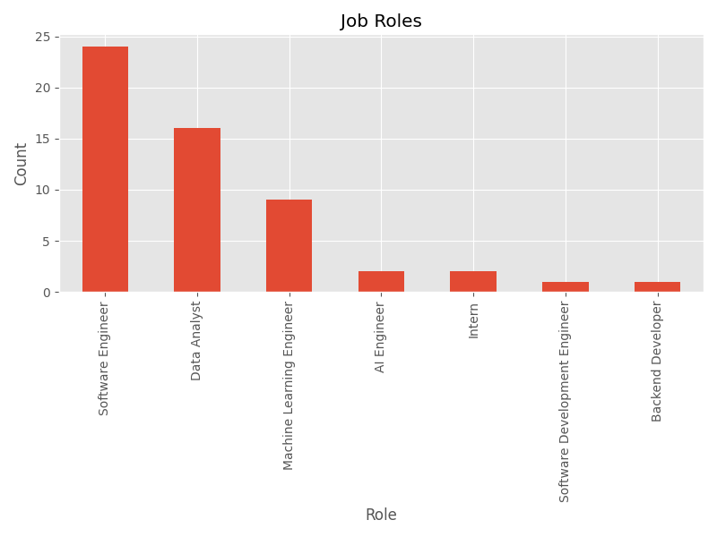
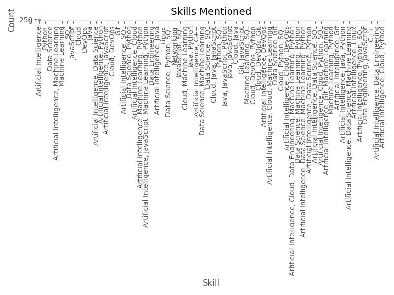
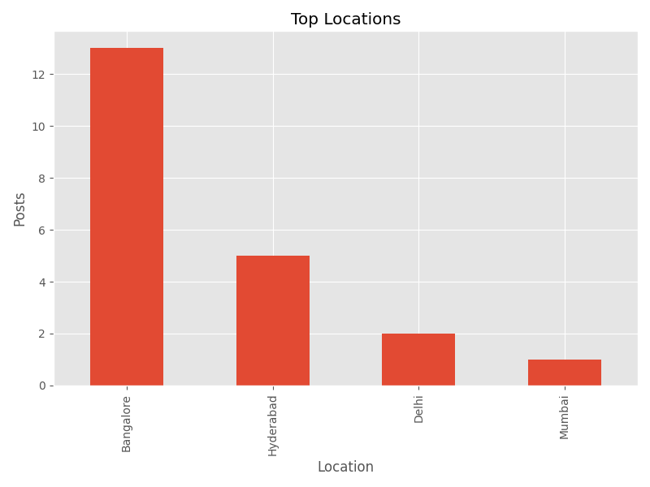
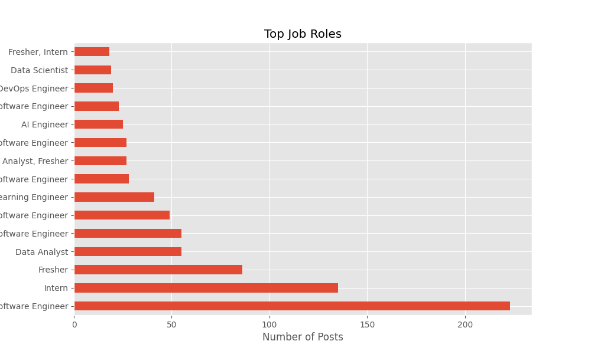
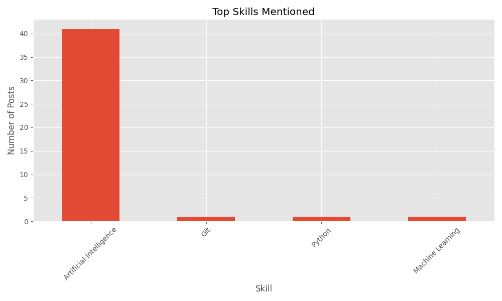
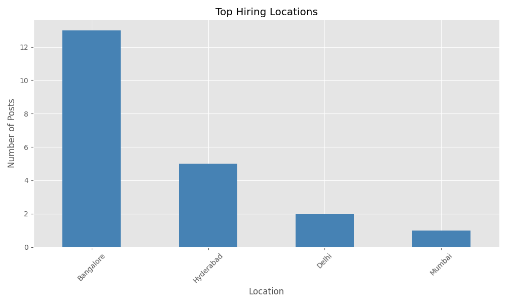
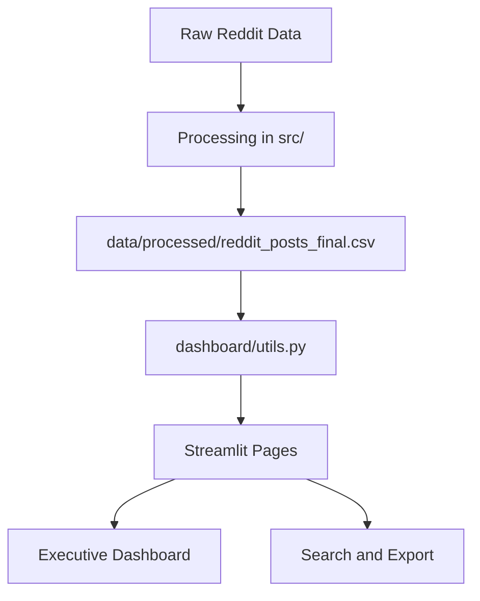

# Reddit Employment Trends in India

Production-style Streamlit analytics platform for exploring Reddit hiring discussions in India.

## Overview

This project analyzes employment-related Reddit posts to surface hiring demand, roles, skills, locations, companies, sentiment, topics, and time-based trends. The dashboard is built for wide-screen presentation, fast filtering, and executive-style reporting.

## Live Dashboard

Deploy the app to Streamlit Community Cloud or Render using the files in this repository to generate a shareable live URL.

## Screenshots








## Key Features

- Dark, responsive dashboard with a professional analytics layout.
- Shared sidebar filters for role, skill, location, company, sentiment, topic, subreddit, and date.
- Cached data loading for faster startup and page navigation.
- Sortable, searchable, paginated tables with CSV exports.
- Plotly-based charts for trends, heatmaps, treemaps, and distribution views.
- Safe handling for missing values and `Unknown` categories.
- Deployment-ready configuration for Streamlit Community Cloud and Render.

## Dashboard Structure

```text
dashboard/
├── app.py
├── utils.py
└── pages/
	├── 1_Overview.py
	├── 2_🛠️_Skills_and_Locations.py
	├── 3_Roles.py
	├── 4_Companies.py
	├── 5_Sentiment.py
	├── 6_Topic_Modeling.py
	├── 7_Trends.py
	└── 8_Search_Posts.py
```

The dashboard uses `dashboard/app.py` as the entry point and centralizes reusable logic in `dashboard/utils.py`.

## Project Architecture



The processing pipeline in `src/` creates normalized posts, role and skill extraction, location normalization, sentiment analysis, topic labels, and trend-ready time fields. The dashboard then enriches the final CSV with company inference, category grouping, and shared filters.

## Data Sources

- Main dataset: `data/processed/reddit_posts_final.csv`
- Supporting artifacts: sentiment, topics, clustering, trend, skills, and location CSVs in `data/processed/`

## Local Setup

### 1. Create and activate an environment

On Windows:

```powershell
python -m venv .venv
.venv\Scripts\activate
```

### 2. Install dependencies

```powershell
pip install -r requirements.txt
```

### 3. Run the dashboard

```powershell
streamlit run dashboard/app.py
```

## Deployment

### Streamlit Community Cloud

1. Push this repository to GitHub.
2. In Streamlit Community Cloud, create a new app from the repository.
3. Set the main file path to `streamlit_app.py`.
4. Commit the CSV files in `data/raw/` and `data/processed/` so Streamlit Cloud receives the dataset needed to rebuild and load the dashboard.
5. On first launch the app regenerates `data/processed/reddit_posts_final.csv` from the tracked raw CSV files if it is missing.

### Render

This repository includes:

- `render.yaml` for service definition.
- `build.sh` for environment setup.
- The build script also regenerates the processed dataset from `data/raw/` during deployment.

Use `streamlit_app.py` as the Streamlit entry point and expose the port provided by Render.

## Validation

Recommended checks before publishing:

```powershell
python -m compileall dashboard
pytest
streamlit run dashboard/app.py
streamlit run streamlit_app.py
```

The dashboard loader validates that the dataset exists and contains the required columns before rendering.

## Repository Cleanup Notes

- `dashboard/` is the active dashboard implementation.
- The placeholder launcher under `app/` has been removed to avoid confusion.
- Cached and generated data folders are ignored via `.gitignore`.

## Tech Stack

- Streamlit
- Plotly
- Pandas
- NumPy
- Scikit-learn
- NLTK
- Selenium for source collection

## Author

Reddit Employment Trends in India
